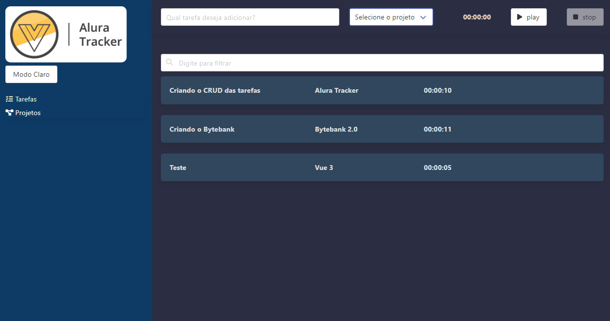

Isto é um projeto gerenciador de tarefas feito em vueJs durante os cursos de Vue3 da Alura, possui um CRUD de projetos e tarefas que ficam armazenados no arquivo db.json (utilizando o json-server).

## Requisitos globais
```
npm i -g json-server
```

## Como abrir e rodar o projeto:
```
npm install
```
### Em Consoles separados

```
json-server --watch db.json
```
```
npm run serve
```


